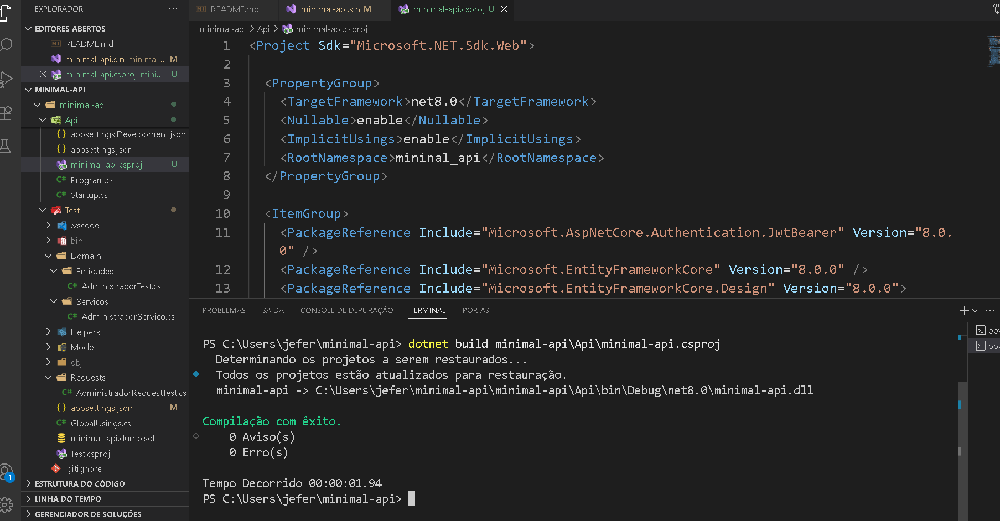
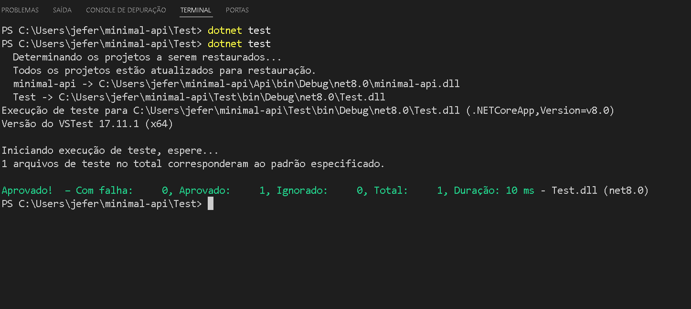
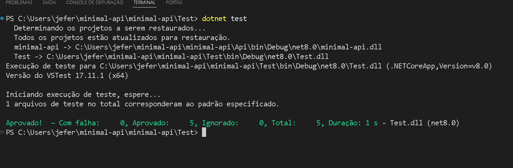
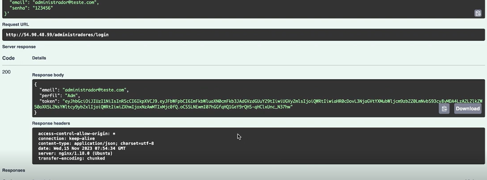

# 🚀 Minimal API com .NET 8

Este projeto demonstra uma API minimalista desenvolvida em **.NET 8**, usando boas práticas, autenticação JWT, testes automatizados com `xUnit` e documentação Swagger.

---

## 📡 Endpoints e Verbos HTTP
A API segue os princípios REST e usa os verbos HTTP principais para operar recursos:

- **GET**: Recupera dados do servidor. Exemplo: listar administradores, obter detalhes de um recurso.
- **POST**: Cria um novo recurso no servidor. Exemplo: criar um novo administrador.
- **PUT**: Atualiza um recurso existente. Exemplo: alterar dados do administrador.
- **DELETE**: Remove um recurso. Exemplo: excluir um administrador.

```bash
# GET - listar administradores
curl -X GET http://localhost:5004/administradores

# POST - criar administrador
curl -X POST http://localhost:5004/administradores \
  -H "Content-Type: application/json" \
  -d '{"email":"novo@teste.com","senha":"123456","perfil":"Administrador"}'

# PUT - atualizar administrador
curl -X PUT http://localhost:5004/administradores/1 \
  -H "Content-Type: application/json" \
  -d '{"senha":"novaSenha"}'

# DELETE - deletar administrador
curl -X DELETE http://localhost:5004/administradores/1


---
## 📸 Visão Geral

### 🔐 Teste Unidade



### 📑 Teste de persistência



### ✅ Teste de request





---

## 🧱 Estrutura do Projeto

```
minimal-api/
│
├── Api/ # Projeto principal da API
│ ├── Controllers/
│ ├── Dominio/
│ ├── DTOs/
│ ├── Infraestrutura/
│ ├── Program.cs
│ └── Startup.cs
│
├── Test/ # Projeto de testes
│ ├── Api.FunctionalTests/
│ │ └── UnitTest1.cs
│ └── Test.csproj
│
├── minimal-api.sln # Solution principal
└── README.md # Este arquivo


```

---

## 🛠️ Tecnologias Utilizadas

- [.NET 8](https://learn.microsoft.com/dotnet/)
- C#
- Entity Framework Core
- MySQL
- xUnit
- Swagger (Swashbuckle)
- JWT Bearer Authentication

---

## ▶️ Como Executar

### Pré-requisitos

- [.NET SDK 8.0](https://dotnet.microsoft.com/download)
- MySQL 8 ou superior
- Visual Studio ou VS Code

### 1. Clone o repositório

```
git clone https://github.com/seu-usuario/minimal-api.git
cd minimal-api
```